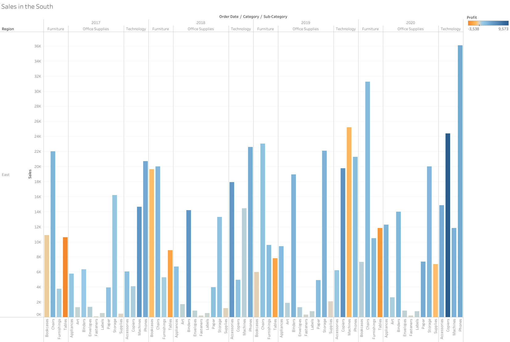
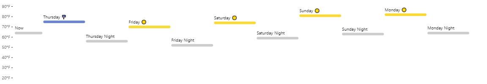

```{r setup, include=FALSE}
knitr::opts_chunk$set(echo = TRUE)
```

## Git, GitHub

1. *What is your GitHub username?*

    **Aeoneve**

2. *What is the URL of your remote GitHub repo (created through Mr. Kennedy's exercises)?*

    **https://github.com/Aeoneve/git-workshop**

## R

The command below will load the tidyverse package.  If you have installed R, RStudio, and the tidyverse package, it should display a list of loaded packages and their versions.
```{r echo=FALSE, message=TRUE}
library(tidyverse)
```

## R Markdown 

1. *Create a bulleted list with at least 3 items*

  * **Item 1**
  * **Item 2**
  * **Item 3**

2. *Write a single paragraph that demonstrates the use of italics, bold, bold italics, code, and includes a link. The paragraph does not have to make sense.*

  This is *italics*, this is **bold**, and this is **_bold italics_**. This is some code:

```{python}
code = "This is code in Python"
print(code)
```

  Lastly, click the word to find a download of [Python](http://python.org)  

3. *Create a level 3 heading*

### This is a 3rd level header

## R 

#### Data Visualization Exercises

install.packages("tidyverse")
library(tidyverse)

ggplot2::mpg

1. (Q2) *How many rows are in mpg? How many columns?*

    **The mpg dataframe contains 234 rows and 11 columns**

1. (Q4) *Make a scatterplot of hwy vs cyl.*
    
```{r}
ggplot(data = mpg) + geom_point(mapping = aes(x = cyl, y = hwy))
```

#### Workflow: basics Exercises

1. (Q2) *Tweak each of the following R commands so that they run correctly (`library(tidyverse)` is correct):*

  * "data" misspelled
  * "filter" misspelled
  * "=" should be "=="
  * "diamonds" misspelled
  
```{r}
library(tidyverse)
ggplot(data = mpg) + 
  geom_point(mapping = aes(x = displ, y = hwy))
filter(mpg, cyl == 8)
filter(diamonds, carat > 3)
```

## Google Colab

1. *What are the URLs of your Google Colab notebooks (both Python and R)?*

[Python Notebook](https://colab.research.google.com/drive/1Jqs3Dy9EzuTKX3OZEJ13c0Wz33_dWOYo?usp=sharing)

[R Notebook](https://colab.research.google.com/drive/1fQt_NIZUjKP7UXYX63w7GklpjFzQbAil?usp=sharing)

## Tableau

*Insert your the image of your final bar chart here*



1. *What conclusions can you draw from the chart?*

  **Sales are increasing each year but Technology is especially strong**

## Observable and Vega-Lite

### A Taste of Observable

1. *In the "New York City weather forecast" section, try replacing `Forecast: detailedForecast` with `Forecast: shortForecast`. Then press the blue play button  or use Shift-Return to run your change. What happens?*

  **The table above changes, under the "Forcast" column most of the text**
  **goes away leaving only a brief explaination of the forecast**

1. *Under the scatterplot of temperature vs. name, try replacing `markCircle()` with `markSquare()`. Then press the blue play button  or use Shift-Return to run your change. What happens? How about `markPoint()`?*

  **markSquare() changes the icons to solid squares and markPoint changes**
  **the icons to hollow circles**

1. *Under "Pick a location, see the weather forecast", pick a location on the map.  Where was the point you picked near?*

  **I attempted to click near Philadelphia and got the coordinates**
  **[-75.87, 40.19], which ended up being New Morgan, PA**

1. *The last visualization on this page is a "fancy" weather chart embedded from another notebook.  Click on the 3 dots next to that chart and choose 'Download PNG'.  Insert the PNG into your report.*



### Charting with Vega-Lite

`markCircle()`

1. *Pass an option of `{ size: 200 }` to `markCircle()`.*

**The circles become so large they are mostly indistinguishable**

1. *Try `markSquare` instead of `markCircle`.*

**The large solid circles become large solid squares**

1. *Try `markPoint({ shape: 'diamond' })`.*

**The chart becomes much nicer looking with small hollow diamonds**

`vl.x().fieldQ("Horsepower")`, ...

1. *Change `Horsepower` to `Acceleration`*

**The data moves to the upper right side of the chart from the**
**upper middle as the x-axis changes from Horsepower to Acceleration**

1. *Swap what fields are displayed on the x- and y-axis*

**The data congregates around the middle of the chart now as the**
**axes flip and Acceleration is the y and Miles_per_Gallon is the x**

`vl.tooltip().fieldN("Name")`

1. *Change `Name` to `Origin`.*

**Each data point now shows the country of origin instead of the**
**name of the car when you hover over it**

Another example, `count()`

1. *Remove the `vl.y().fieldN("Origin")` line.*

**All the data gets combined into one count and the y axis is removed**

1. *Replace `count()` with `average("Miles_per_Gallon")`.*

**The average of all the combined data is computed and displayed**
**on the x-axis as a bar chart**

## References

*Every report must list the references that you consulted while completing the assignment. If you consulted a webpage, you must include the URL.*

* https://classroom.github.com/
* https://github.com/
* https://git.cs.odu.edu/tkennedy/git-workshop/-/wikis/Git-Workshop
* https://www.rstudio.com/
* https://github.com/odu-cs625-datavis/github-classroom-for-students/blob/master/README.md
* https://r4ds.had.co.nz/
* https://github.com/adam-p/markdown-here/wiki/Markdown-Cheatsheet
* https://colab.research.google.com/
* https://www.tableau.com/learn/tutorials/on-demand/getting-started
* https://www.earthdatascience.org/courses/earth-analytics/document-your-science/add-images-to-rmarkdown-report/
* https://observablehq.com/

